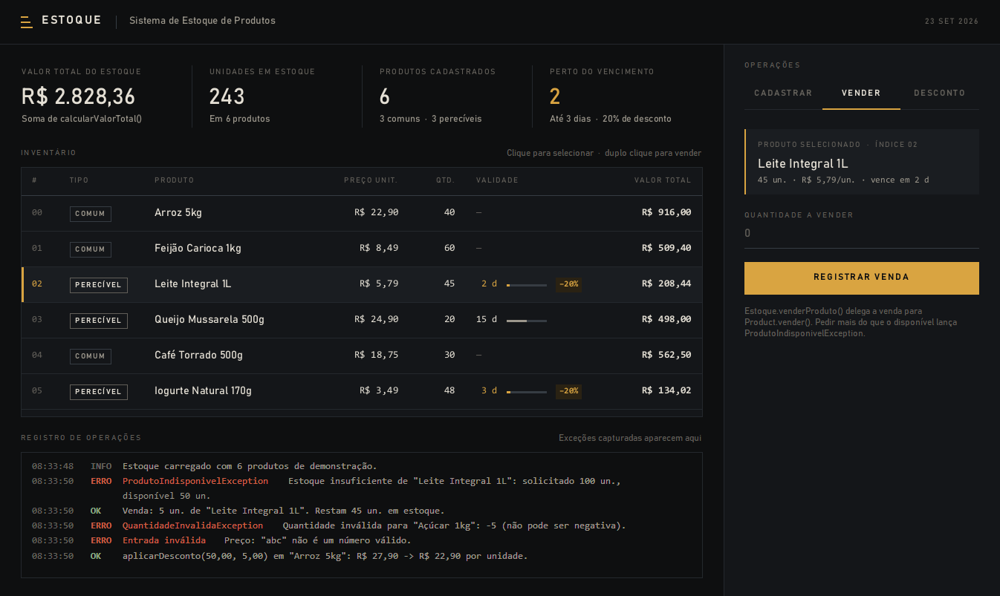
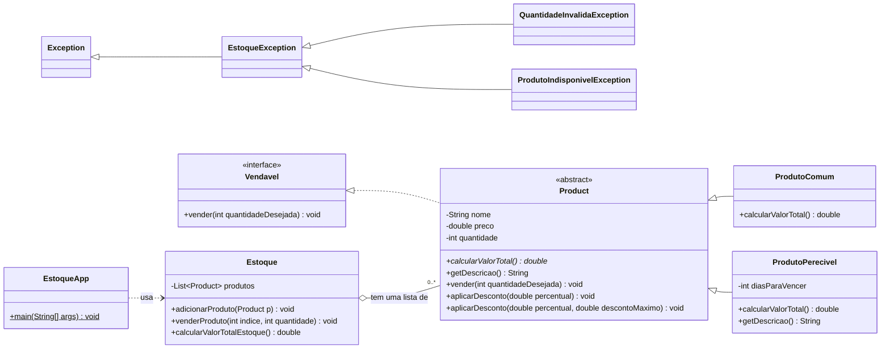

# Sistema de Estoque de Produtos

**Paradigmas de Linguagens · Atividade 1 (Primeira Avaliação)**
Java: classes abstratas, herança, interfaces, polimorfismo, composição e exceções.




---

## Sobre o software

Programa em Java para uma loja que precisa:

- **cadastrar produtos** de dois tipos, comuns e perecíveis;
- **controlar a venda** de itens do estoque;
- **tratar situações inválidas**, como quantidade negativa ou venda acima do disponível.

Tudo isso usa uma hierarquia de classes bem definida em vez de `if`s soltos. Cada tipo de
produto calcula o próprio valor, e o estoque soma tudo sem precisar saber qual é o tipo de
cada item.

O projeto tem duas formas de uso:

| Aplicação | Classe | Descrição |
|-----------|--------|-----------|
| **Console** (entrega do exercício) | `estoque.EstoqueApp` | Executa a demonstração pedida no item 7 do enunciado. |
| **Interface gráfica** (extra) | `estoque.gui.EstoqueGUI` | Tela desktop para cadastrar, vender e aplicar descontos com as mesmas classes. |

---

## Checklist de entrega

- [x] Todas as classes e interfaces (`EstoqueException`, `QuantidadeInvalidaException`,
      `ProdutoIndisponivelException`, `Product`, `ProdutoComum`, `ProdutoPerecivel`, `Vendavel`,
      `Estoque`, `EstoqueApp`), **compilando sem erros**.
- [x] A saída do programa mostrando: os produtos cadastrados, o valor total do estoque, as duas
      exceções sendo capturadas corretamente e uma venda bem-sucedida
      ([ver saída completa](#saída-do-programa)).

---

## Requisitos do enunciado × implementação

| Item | Requisito | Implementação |
|:----:|-----------|---------------|
| **1** | Hierarquia de exceções | [`EstoqueException`](src/estoque/excecoes/EstoqueException.java) `extends Exception`. [`QuantidadeInvalidaException`](src/estoque/excecoes/QuantidadeInvalidaException.java) e [`ProdutoIndisponivelException`](src/estoque/excecoes/ProdutoIndisponivelException.java) herdam dela, exatamente como no enunciado. |
| **2** | Classe abstrata `Product` | [`Product`](src/estoque/produtos/Product.java) tem os atributos `private` `nome`, `preco` e `quantidade`. O construtor lança `QuantidadeInvalidaException` se o preço ou a quantidade forem negativos. Tem o método abstrato `calcularValorTotal()` e o concreto `getDescricao()`, e implementa `Vendavel`. |
| **3** | Subclasses (herança + polimorfismo dinâmico) | [`ProdutoComum`](src/estoque/produtos/ProdutoComum.java) calcula `preco × quantidade`. [`ProdutoPerecivel`](src/estoque/produtos/ProdutoPerecivel.java) tem o atributo `diasParaVencer`, sobrescreve (`@Override`) `calcularValorTotal()` com **20% de desconto quando `diasParaVencer <= 3`** e sobrescreve `getDescricao()` para incluir a validade. |
| **4** | Interface `Vendavel` | [`Vendavel`](src/estoque/produtos/Vendavel.java) declara `vender(int) throws ProdutoIndisponivelException`. Em `Product`, a venda lança a exceção se a quantidade pedida for maior que o estoque; caso contrário, subtrai a quantidade vendida. |
| **5** | Sobrecarga `aplicarDesconto()` (polimorfismo estático) | Em `Product`: `aplicarDesconto(double percentual)` e `aplicarDesconto(double percentual, double descontoMaximo)`. A segunda limita o desconto a um valor máximo em reais. |
| **6** | Classe `Estoque` (composição) | [`Estoque`](src/estoque/Estoque.java) **tem uma** `List<Product>` e não herda de `Product`. Métodos: `adicionarProduto()`, `venderProduto()` (propaga `ProdutoIndisponivelException`) e `calcularValorTotalEstoque()`, que soma `calcularValorTotal()` de cada produto sem verificar o subtipo. |
| **7** | `EstoqueApp` com `main()` | [`EstoqueApp`](src/estoque/EstoqueApp.java) cadastra 2 `ProdutoComum` e 2 `ProdutoPerecivel` (um vence em 2 dias), captura `QuantidadeInvalidaException` no cadastro com quantidade negativa, faz uma venda válida, captura `ProdutoIndisponivelException` na venda acima do disponível e imprime o valor total do estoque. |
| **Pista** | Ordem dos catches | Seção 6 da `EstoqueApp`: um único `try` com `catch (QuantidadeInvalidaException)`, depois `catch (ProdutoIndisponivelException)` e, **por último**, `catch (EstoqueException)`. Cada um dos três é acionado por um cenário real. |

### Onde cada conceito aparece

| Conceito | Onde |
|----------|------|
| Classe abstrata | `Product` não pode ser instanciada e obriga as subclasses a implementar `calcularValorTotal()`. |
| Encapsulamento | Atributos `private` com acesso apenas por getters; o preço só muda via `aplicarDesconto()`. |
| Herança | `ProdutoComum` e `ProdutoPerecivel` estendem `Product`; as exceções estendem `EstoqueException`. |
| Interface | `Product implements Vendavel`. |
| Polimorfismo dinâmico | `Estoque.calcularValorTotalEstoque()` chama `calcularValorTotal()` em cada `Product` e a JVM decide qual versão executar. |
| Polimorfismo estático | As duas assinaturas de `aplicarDesconto()` são resolvidas em tempo de compilação. |
| Composição | `Estoque` **tem uma** lista de `Product`. |
| Exceções verificadas | Hierarquia própria, `throws` nas assinaturas e `catch` do mais específico para o mais genérico. |

---

## Diagrama de classes



---

## Como executar

**Requisito:** JDK 8 ou superior instalado (`java -version` e `javac -version` no terminal).

### Windows (dois cliques)

| Arquivo | Abre |
|---------|------|
| `executar.bat` | Aplicação de console (`EstoqueApp`) |
| `executar-gui.bat` | Interface gráfica (`EstoqueGUI`) |

### Linux / macOS

```bash
./executar.sh        # console
./executar.sh gui    # interface gráfica
```

### Manualmente (qualquer sistema)

```bash
javac -encoding UTF-8 -d out src/estoque/*.java src/estoque/excecoes/*.java src/estoque/produtos/*.java src/estoque/gui/*.java

java -cp out estoque.EstoqueApp        # console
java -cp out estoque.gui.EstoqueGUI    # interface gráfica
```

### Em uma IDE

Abra a pasta no IntelliJ IDEA, Eclipse, NetBeans ou VS Code, marque `src` como pasta de
código-fonte e execute `estoque.EstoqueApp`.

---

## Saída do programa

Saída real de `EstoqueApp`:

```text
==========================================================================
                    SISTEMA DE ESTOQUE DE PRODUTOS
==========================================================================

--- 1. Cadastro de produtos ---
4 produtos cadastrados com sucesso:
[0] ProdutoComum     Arroz 5kg              | Preço:     R$ 27,90 | Quantidade:   40 un.
    Valor total: R$ 1.116,00
[1] ProdutoComum     Feijão Carioca 1kg     | Preço:      R$ 8,49 | Quantidade:   60 un.
    Valor total: R$ 509,40
[2] ProdutoPerecivel Leite Integral 1L      | Preço:      R$ 5,79 | Quantidade:   50 un. | Vence em: 2 dia(s) -> 20% de desconto (perto do vencimento)
    Valor total: R$ 231,60
[3] ProdutoPerecivel Queijo Mussarela 500g  | Preço:     R$ 24,90 | Quantidade:   20 un. | Vence em: 15 dia(s)
    Valor total: R$ 498,00
Valor total do estoque: R$ 2.355,00

--- 2. Tentativa de cadastro com valores inválidos ---
Tentando cadastrar "Açúcar 1kg" com quantidade -5...
[QuantidadeInvalidaException capturada] Quantidade inválida para "Açúcar 1kg": -5 (não pode ser negativa).
Tentando cadastrar "Iogurte Natural" com preço -3,50...
[QuantidadeInvalidaException capturada] Preço inválido para "Iogurte Natural": R$ -3,50 (não pode ser negativo).
Produtos no estoque após as tentativas: 4 (nenhum produto inválido foi adicionado).

--- 3. Venda de uma quantidade válida ---
Vendendo 5 un. do produto no índice 0...
[VENDA REALIZADA] 5 un. de "Arroz 5kg". Restam 35 un. em estoque.

--- 4. Tentativa de venda acima do disponível ---
Vendendo 100 un. do produto no índice 2...
[ProdutoIndisponivelException capturada] Estoque insuficiente de "Leite Integral 1L": solicitado 100 un., disponível 50 un.

--- 5. Sobrecarga de aplicarDesconto() ---
aplicarDesconto(10) em "Arroz 5kg": R$ 27,90 -> R$ 25,11 (10% de desconto)
aplicarDesconto(50, 5.00) em "Queijo Mussarela 500g": R$ 24,90 -> R$ 19,90 (50% daria R$ 12,45 de desconto, mas foi limitado a R$ 5,00)

--- 6. Ordem dos catches (cadastro + venda no mesmo try) ---
Pedido: cadastrar "Detergente 500ml" (-3 un.) e vender 1 un.
  [QuantidadeInvalidaException capturada] Quantidade inválida para "Detergente 500ml": -3 (não pode ser negativa).
Pedido: cadastrar "Refrigerante 2L" (12 un.) e vender 20 un.
  [ProdutoIndisponivelException capturada] Estoque insuficiente de "Refrigerante 2L": solicitado 20 un., disponível 12 un.
Pedido: cadastrar "Macarrão 500g" (25 un.) e vender 0 un.
  [EstoqueException capturada] Pedido recusado: a quantidade de venda deve ser maior que zero.
Pedido: cadastrar "Café 500g" (30 un.) e vender 6 un.
  [OK] Produto cadastrado e venda realizada.

--- 7. Estoque final e valor total ---
[0] ProdutoComum     Arroz 5kg              | Preço:     R$ 25,11 | Quantidade:   35 un.
    Valor total: R$ 878,85
[1] ProdutoComum     Feijão Carioca 1kg     | Preço:      R$ 8,49 | Quantidade:   60 un.
    Valor total: R$ 509,40
[2] ProdutoPerecivel Leite Integral 1L      | Preço:      R$ 5,79 | Quantidade:   50 un. | Vence em: 2 dia(s) -> 20% de desconto (perto do vencimento)
    Valor total: R$ 231,60
[3] ProdutoPerecivel Queijo Mussarela 500g  | Preço:     R$ 19,90 | Quantidade:   20 un. | Vence em: 15 dia(s)
    Valor total: R$ 398,00
[4] ProdutoComum     Refrigerante 2L        | Preço:      R$ 9,99 | Quantidade:   12 un.
    Valor total: R$ 119,88
[5] ProdutoComum     Café 500g              | Preço:     R$ 18,75 | Quantidade:   24 un.
    Valor total: R$ 450,00

VALOR TOTAL DO ESTOQUE: R$ 2.587,73
(soma de calcularValorTotal() de cada produto: comuns = preço x quantidade;
 perecíveis com até 3 dias para vencer recebem 20% de desconto automático)
==========================================================================
```

**Conferência do valor total:** 878,85 + 509,40 + 231,60 *(leite: 5,79 × 50 com 20% de desconto)* + 398,00 + 119,88 + 450,00 = **R$ 2.587,73**.

---

## Interface gráfica (extra)

Além da aplicação de console exigida, o projeto inclui uma interface desktop em Swing que usa
**as mesmas classes de domínio**, sem duplicar nenhuma regra de negócio.

- **Cadastrar:** produto comum ou perecível. Valores negativos disparam `QuantidadeInvalidaException`.
- **Vender:** selecione uma linha na tabela e informe a quantidade. Vender acima do estoque dispara `ProdutoIndisponivelException`.
- **Desconto:** usa `aplicarDesconto(percentual)` ou, se o desconto máximo for preenchido, `aplicarDesconto(percentual, descontoMaximo)`.
- **Registro de operações:** toda exceção capturada aparece com o nome da sua classe.
- **Painel de indicadores:** valor total do estoque, unidades, produtos e perecíveis perto do vencimento.
- **Tabela:** mostra a validade dos perecíveis em uma barra e sinaliza o desconto automático de 20%.

Todos os componentes visuais são desenhados sob medida com Java 2D, sem bibliotecas externas.

---

## Estrutura do projeto

```
src/estoque/
├── Estoque.java                         Composição: tem uma lista de Product
├── EstoqueApp.java                      main() com a demonstração do item 7
├── excecoes/
│   ├── EstoqueException.java            Exceção base (checked)
│   ├── QuantidadeInvalidaException.java
│   └── ProdutoIndisponivelException.java
├── produtos/
│   ├── Vendavel.java                    Interface
│   ├── Product.java                     Classe abstrata
│   ├── ProdutoComum.java
│   └── ProdutoPerecivel.java
└── gui/                                 Interface gráfica (extra)
    ├── EstoqueGUI.java
    ├── TabelaProdutos.java
    ├── Componentes.java
    └── Tema.java
```

## Decisões de projeto

Pontos que o enunciado deixa em aberto e como foram tratados:

- **Percentual de desconto:** `aplicarDesconto(10)` significa 10%. Valores fora de 0 a 100 lançam `IllegalArgumentException`.
- **Venda de quantidade zero ou negativa:** lança `IllegalArgumentException`. `ProdutoIndisponivelException` fica reservada para a falta de estoque, como define o contrato de `Vendavel`.
- **Índice inexistente** em `Estoque.venderProduto()`: lança `ProdutoIndisponivelException`, já que o produto pedido não está disponível.
- **Perecível já vencido** (`diasParaVencer` negativo): é recusado com `QuantidadeInvalidaException`.
- **Formato monetário:** padrão brasileiro (`R$ 1.234,56`).
- **Compatibilidade:** o código usa apenas recursos do Java 8 e compila com `--release 8 -Xlint:all` sem nenhum aviso.

---

<sub>Atividade acadêmica · Paradigmas de Linguagens · Gustavo Hudson</sub>
